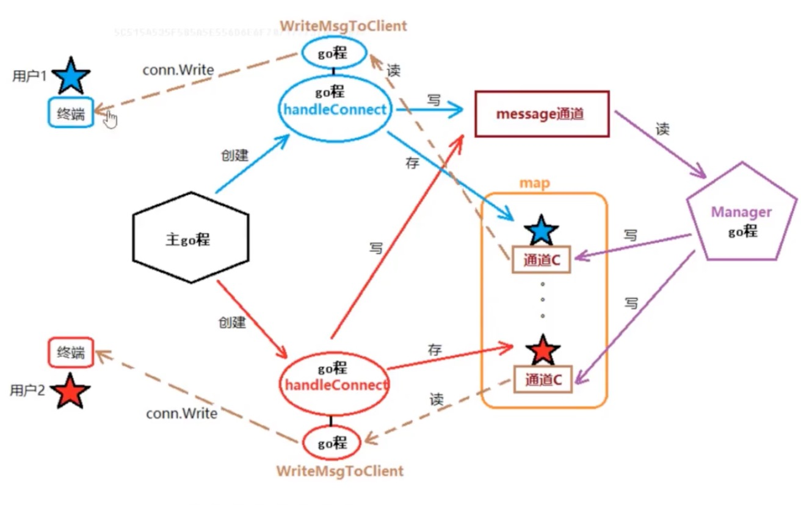

# GoAdvance
简单聊天室



聊天室模块划分：
主go程：
创建监听socket。for循环Accept0客户端连接-conn。启动go程HandlerConnect：

HandlerConnect:
创建用户结构体对象。存入onlineMap。发送用户登录广播、聊天消息。处理查询在线用户、改名、下线、超时提出，

Manager:
监听全局channel message，将读到的消息广播给onlineMap中的所有用户。

WriteMsgToClient:
读取每个用户自带channelC上消息（由Manager发送该消息）。回写给用户。

全局数据模块：
用户结构体：Client{C、Name. Addr string}
在现用户列表：onlineMap【string】Client key：客户端IP+port value： Client

消息通道：message

```

/**                      1.广播上线用户：
1.主go程中，创建监听狄接字。记得defer
2. for征环监听密户端连接请求。Accept（）
3.有一个密户端连接，创建新go程处理嵇户端数据HandlerConnet（conn）defer
4.定义全局结构体类型C、Name、Addr
5.创建全局map. channel
6.实现HandlerConnet，获取密户端IP+port一RemoteAddr0。初始化新用户结构体信息。name ==Addr
7.创建Manager实现管理go程。Accept0之前。
8.实现Manager。初始化在线用户map。征环读取全局channel，如果无数据，阻立。如果有数据，遍历在线用户map，将数据写到用户的C里9.将新用户添加到在线用户map中。Key==IP+port value=新用户结构体
10. 创建WriteMsgToClient go程，专门给当前用户写数据。
来源于用户自带的C中
11.实现WriteMsgTolient （cnt，conn）。遍历自带的C，读数据，conn.Write到密户端
12.HandlerConnet中，结束位置，组织用户上线信息，将用户上线化息写到全局 channel
-Manager的读就被激活（原来一直阻立）
13. HandlerConnet中，结尼加for{；}
*/
/**
                        2.广播用户消息：
1.封装函数MakeMsg0来处理广播、用户消息
2. HandlerConnet中，创建匿名go程，读取用户socket上发送来的聊天内容。写到全局channel
3. for循环conn.Read n==0 err!= nil
4.写给全局message一后续的事，原来广播用户上线模块完成。（Manager.WriteMsgToClient
*/

/*
                        3.查询在线用户：
1.将读取到的用户消息msg结尾的“\n”去掉。
2.判断是否是“who”命令
3.如果是，遍历在线用户列表，组织显示信息。写到socket中。
4.如果不是。写给全局message
*/

/*
                        4.修改用户名：
1.将读取到的用户消息msg判断是否包含“rename|"
2.提取“”后面的字符串。存入到Client的Name成员中
3.更新在线用户列表。onlineMap. key - IP+port
4.提示用户更新完成。conn.Write
 */
/*
                        5.用户退出：
1.在用户成功登陆之后，创建监听用户退出的channel一isQuit
2.当conn.Read ==0，isQuit 《-true
3.在HandlerConnet结几for中，添加select 监听《-isQuitI
4.条件满足。将用户从在结列表移除。组织用户下线消息，写入message（广播）
*/

/*
                        6.超时强踢：
1.在select中监听定时器。（time.After（）计时到达。将用户从在线列表移除。组织用户下线消患，写入message（广插） 2.创建监听用户活跃的channel 一 hasData
3.只用户执行：聊天、改名、who任意一个操作，hasData《- true
4.在select中添加监听《-hasData。条件满足，不做任何事情。目的是重量计时器。
*/
```

简单测试

```sh
$ nc 127.0.0.1 8000
```

